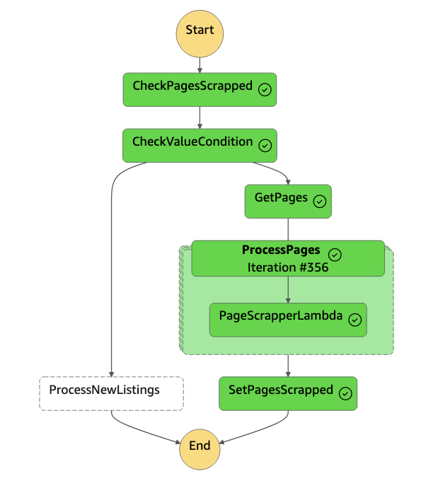
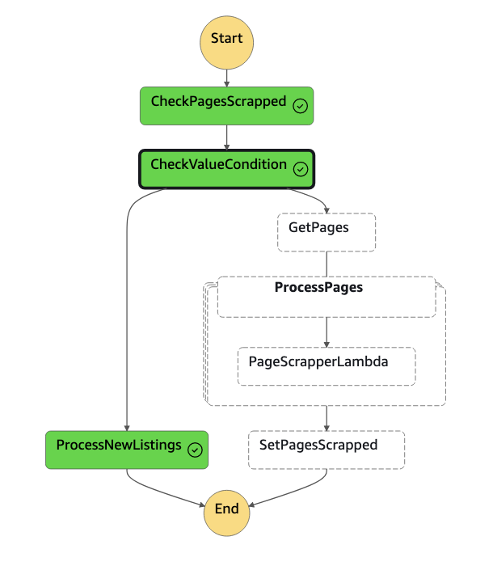

# auto.am scrapper

This scraper utilizes AWS serverless technologies to scrape data from auto.am and stores it in an RDS PostgreSQL database.

The project is built using [AWS SAM](https://aws.amazon.com/serverless/sam/) to construct and deploy Lambda functions and the underlying AWS stack into the cloud and running for every commit to main branch using github actions.

### Architecture

The main component of the entire architecture is the AWS State Machine, which runs on a daily schedule. The state machine has two branches: one for fetching the entire dataset and another for retrieving new listings.

