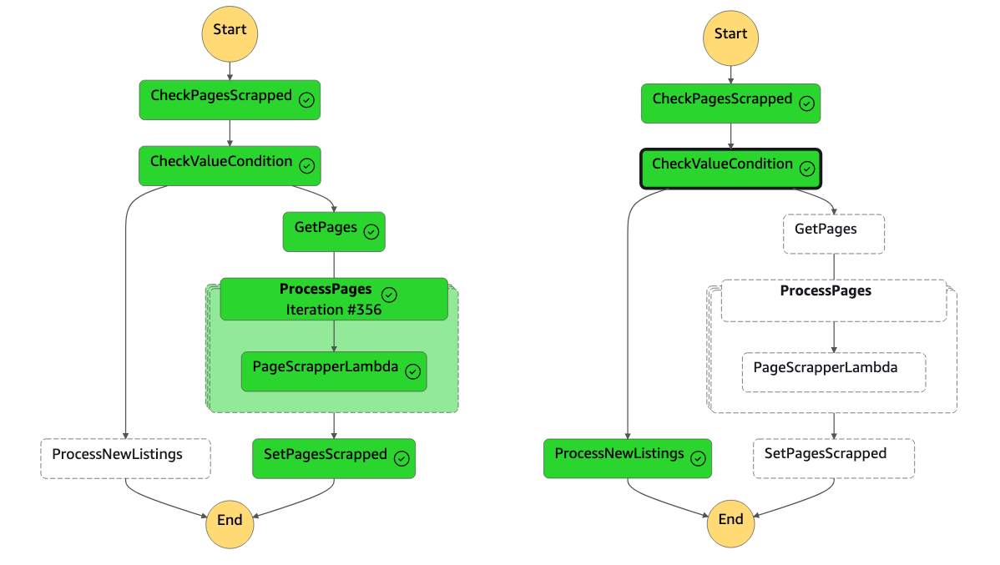

# auto.am scrapper

This scraper utilizes AWS serverless technologies to scrape data from auto.am and stores it in an RDS PostgreSQL database.

The project is built using [AWS SAM](https://aws.amazon.com/serverless/sam/) to construct and deploy Lambda functions and the underlying AWS stack into the cloud and running for every commit to main branch using github actions.

### Architecture

The main component of the entire architecture is the AWS State Machine, which runs on a daily schedule. The state machine has two branches: one for fetching the entire dataset and another for retrieving new listings.

The scrapped URLs for listing, which are processed by Lambda functions ([PageScrapperFunction](src/page-scrapper/app.py) and [ProcessNewListingsFunction](src/process-new-listings/app.py)) in Step Function, are placed into an SQS Queue. Subsequently, these URLs are consumed by [WarehouseProvisioner](src/warehouse-provisioner/app.py), which retrieves information (vin, make, price, etc.) for each specific listing URL and stores that information in the RDS PostgreSQL database.

#### Lambda Functions

- **[CheckPagesScrappedFunction](src/check-pages-scrapped/app.py)** - Just checking (using parameter store) whether this Step Function has run before, in order to determine whether we need to scrape the entire dataset or only new listings.
- **[GetPagesFunction](src/get-pages/app.py)** - Returns page count for auto.am to walk trough each page parallely, for scrapping listing URLS for each page in leter stage (runs only once).
- **[PageScrapperFunction](src/page-scrapper/app.py)** - Scraping for each page listed by GetPages and putting listing URLs into SQS.
- **[ProcessNewListingsFunction](src/process-new-listings/app.py)** - Scraping the initial pages to find matches for listings; if a listing that has already been scraped is found, the execution is halted, and new URLs are placed into SQS.
- **[SetPagesScrappedFunction](src/set-pages-scrapped/app.py)** - After completing the scraping of the entire dataset, a parameter is placed into the parameter store to inform the Step Function that only new listings need to be retrieved for later executions.
- **[WarehouseProvisioner](src/warehouse-provisioner/app.py)** - Consuming URLs from the SQS queue (trigger for lambda function) and retrieving data from listing URLs, then placing the gathered information into the RDS PostgreSQL database (including price, VIN, make, model, etc.).

> *Note: The **src/init-database/app.py** lambda functions used to initiate database and table. We found this code from other repository. Used as Custom Resource for CloudFormation.* 

